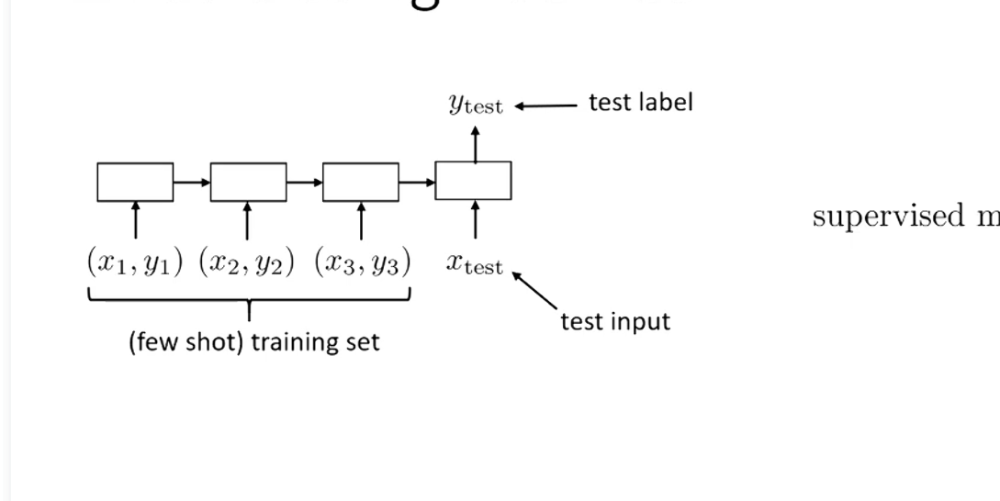

# Meta-Learning

Meta-learning means "learning to learn."

## Few-Shot Learning

Few-shot learning aims to learn a new task from only a small number of examples.

## Meta-Training vs Meta-Testing

| Stage | Support (training examples) | Query (test examples) |
| --- | --- | --- |
| Meta-training | pic1, pic2, pic3, ..., pic5 | ~pic1, ~pic4, ... |
| Meta-testing | New classes/tasks with few labeled examples | Evaluate on unseen query examples |

## Traditional Supervised Learning

Given input-output pairs $(x, y)$, learn a mapping:

$$
f(x) \rightarrow y
$$

## Meta-Learning Setting

Given an input $x$ and a small dataset $\mathcal{D}$ (support set), learn a task-adaptive mapping:

$$
f(\mathcal{D}^{\text{tr}}, x) \rightarrow y
$$

## Few-Shot Inference Flow (Illustration)

Suppose a task has a few training examples (support set):
$(x_1, y_1), (x_2, y_2), (x_3, y_3)$.
These support examples are fed into the model as shown in the figure, in a sequential manner. The model extracts task-specific information and then predicts $\hat y_{test}$ for a new query input $x_{test}$, which is compared with the ground truth label $y_{test}$. The function effectively "learns" from $\mathcal{D}^{\text{tr}}$ on the fly to process $x_{test}$.

- Meta-training: the model repeats this few-shot episode learning over many tasks.
- Meta-testing: the model sees a new task with only a few labeled examples and quickly adapts to predict on query inputs.

This matches the picture's meaning: few-shot training set + test input → test label.

## Small Notes

- $\mathcal{D}$ provides task context, so the model can adapt quickly to new tasks.
- Meta-training teaches transferable learning strategies, not just one fixed task.
- Meta-testing checks whether this adaptation works on unseen tasks.

## Paradigm Comparison: Standard Learning vs. Meta-Learning

### "Generic" Learning

In standard machine learning, the goal is to find a single set of optimal parameters $\theta^\star$ that minimizes the loss on a specific training dataset.

**Optimization Objective**:
$$
\theta^\star = \arg\min_\theta \mathcal{L}(\theta, \mathcal{D}^{\text{tr}})
$$
- $\theta$: The model parameters.
- $\mathcal{L}$: The loss function.
- $\mathcal{D}^{\text{tr}}$: The training dataset.

**Conceptual Abstraction**:
$$
= f_{\text{learn}}(\mathcal{D}^{\text{tr}})
$$
This implies the learning process itself ($f_{\text{learn}}$) maps a training dataset to optimal parameters. What is being "learned" are the specific parameters $\theta^\star$ for one specific task.

### "Generic" Meta-Learning

In meta-learning, the objective shifts from learning parameters for a single task to learning a set of global "meta-parameters" ($\theta$) that can quickly adapt to multiple different tasks ($i = 1 \dots n$).

**Optimization Objective**:
$$
\theta^\star = \arg\min_\theta \sum_{i=1}^n \mathcal{L}(\phi_i, \mathcal{D}_i^{\text{ts}})
$$
- $\theta^\star$: The optimal global meta-parameters.
- $n$: The number of meta-training tasks.
- $\mathcal{L}$: The loss function evaluated on task $i$.
- $\phi_i$: The task-specific parameters for task $i$.
- $\mathcal{D}_i^{\text{ts}}$: The test set (or validation set) for task $i$.

**Parameter Adaptation Mechanism**:
$$
\text{where } \phi_i = f_\theta(\mathcal{D}_i^{\text{tr}})
$$
- $f_\theta$: The meta-learner model parameterized by $\theta$.
- $\mathcal{D}_i^{\text{tr}}$: The training set (support set) for task $i$.

**Key Distinction**: In meta-learning, what is being "learned" is the global parameter set $\theta^\star$. These parameters dictate the behavior of the adaptation function $f_\theta$, which takes a small task-specific training set ($\mathcal{D}_i^{\text{tr}}$) and rapidly outputs the optimal task-specific parameters ($\phi_i$). The overall system is optimized to ensure that these adapted parameters ($\phi_i$) perform well on the unseen test data ($\mathcal{D}_i^{\text{ts}}$) of that specific task.

### Example: Black-Box Meta-Learning Using Sequence Models

As illustrated in the diagram, a sequence model (e.g., an RNN or LSTM) can serve as the meta-learner $f_\theta$. 

- **Sequence Processing**: The model ingests the support set sequentially as $(x_1, y_1), (x_2, y_2), \dots$ and uses shared global meta-parameters **$\theta^\star$** to update its hidden state.
- **Task Context ($h_i$)**: After processing the support set for task $i$, the model produces a final hidden state **$h_i$**. This state encapsulates the "learned" information about the specific task.
- **Task-Specific Parameters ($\phi_i$)**: The parameters used for the final prediction on a new query $x$ are defined as:
  $$
  \phi_i = [h_i, \theta_p]
  $$
  Where:
  - $h_i$ represents the dynamically generated task-specific context (the state extracted from the support set).
  - $\theta_p$ represents any shared network parameters used by the final predictor head.
- **Final Prediction**: The model combines the task context $h_i$ and the query $x$ to output the prediction $y$, defined by the task-specific distribution $p_{\phi_i}(y|x)$.

### Remark: Understanding $h$ vs. $\theta$ in Meta-Learning

In this context, it is crucial to understand that $h$ is a **Hidden Vector (Activation)**, not a **Parameter (Weight)**. Confusing these two concepts will make it difficult to grasp the fundamental differences between the inference and training phases in meta-learning.

#### 1. The Mathematical Nature
In a standard neural network mapping $y = f(x; \theta)$:
- **Parameters ($\theta$)**: Belong to the model's manifold space. They are the invisible "rules" that determine the shape of the function. During inference, they are fixed **constants**, and they only change during the training phase via **backpropagation**.
- **Activations/Hidden Vectors ($h$)**: Belong to the model's computational path. They are intermediate representations generated as data passes through the function. During inference, they are **variables** that change continuously with different input data.

#### 2. Why is $h$ included in $\phi$ in the formula?
Writing $\phi_i = [h_i, \theta_p]$ is a logical abstraction to uniformly describe the "task-specific state" at the generalization level.
- **Logical Level**: For the final prediction layer (classification head), it receives two things: the test sample $x$ and the task context $h_i$. For mathematical convenience, we treat $h_i$ as the "temporary identity" of this prediction layer for that specific task. At this level of abstraction, we can call $\phi_i$ the "parameters" of task $i$.
- **Physical Level**: The prediction layer is actually a fixed function (parameterized by $\theta_p$) that takes the concatenated $[h_i, x]$ as its input.

> black-box meta-learning
> non-parametric meta-learning
> gradient-based meta-learning
Meta-learning's "smartness" lies in the way it processes data.

> MAML

